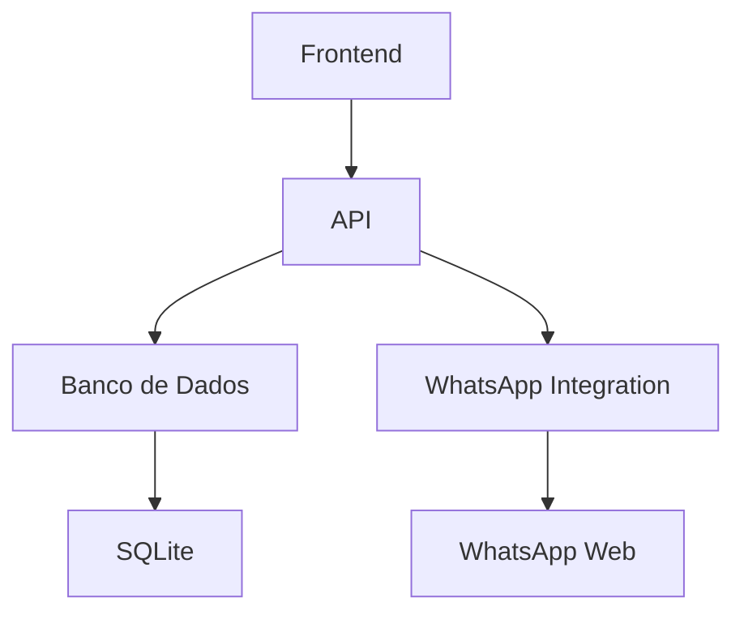

# ADVSac v1.0.0

## Visão Geral
O ADVSac é um sistema completo para gestão de atendimento via WhatsApp, oferecendo:

- Gerenciamento de múltiplos canais
- CRM integrado
- Dashboard analítico
- Fluxos de trabalho customizáveis
- Sistema de permissões e roles

## Funcionalidades Principais

### Atendimento
- Integração com WhatsApp
- Histórico de conversas
- Transferência entre setores
- Tags e categorização

### CRM
- Kanban de atendimentos
- Gerenciamento de contatos
- Anotações e follow-ups
- Métricas de desempenho

### Administração
- Gestão de usuários
- Controle de permissões
- Configurações do sistema
- Logs de atividades

## Arquitetura

### Diagrama de Alto Nível


### Tecnologias
- **Frontend**: Next.js, React, Tailwind CSS
- **Backend**: Next.js API Routes
- **Banco de Dados**: Prisma ORM + SQLite
- **Integrações**: WhatsApp Web.js

## Estrutura de Pastas

### 📁 app/
- **layout.tsx**: Layout principal
- **page.tsx**: Página inicial
- **components/**: Componentes reutilizáveis
- **hooks/**: Custom hooks
- **lib/**: Utilitários e serviços
- **prisma/**: Configurações do ORM
- **public/**: Assets estáticos

### 📁 app/atendimento/
- **page.tsx**: Interface de atendimento
- **api/**: Endpoints relacionados

### 📁 app/dashboard/
- **page.tsx**: Painel administrativo

## Configuração

### Requisitos
- Node.js 18+
- NPM 9+
- WhatsApp Business Account

### Instalação
```bash
# Clonar repositório
git clone https://github.com/seu-usuario/advsac.git

# Instalar dependências
npm install

# Configurar variáveis de ambiente
cp .env.example .env

# Executar migrações do banco de dados
npx prisma migrate dev --name init

# Iniciar servidor de desenvolvimento
npm run dev
```

## API Reference

### Endpoints Principais

#### GET /api/atendimento/status
Retorna status da conexão WhatsApp

#### POST /api/atendimento/message
Envia mensagem via WhatsApp

#### GET /api/atendimento/history
Recupera histórico de mensagens

## Desenvolvimento

### Convenções
- TypeScript estrito
- Componentes funcionais
- Hooks para lógica complexa
- Tailwind para estilização

### Boas Práticas
- Sempre tipar props e estados
- Manter componentes pequenos e focados
- Usar hooks personalizados para lógica reutilizável
- Seguir padrões de acessibilidade

## FAQ

### Como configurar o WhatsApp?
1. Criar conta Business no WhatsApp
2. Configurar número no sistema
3. Escanear QR Code

### Como adicionar novos usuários?
1. Acessar painel admin
2. Criar novo usuário
3. Definir permissões

## Roadmap

### Versão 1.1
- [ ] Integração com Telegram
- [ ] Exportação de relatórios
- [ ] Notificações push

### Versão 1.2
- [ ] Chatbot com IA
- [ ] Integração com CRM externo
- [ ] Multi-idiomas

## Licença
Todos os direitos reservados 2024 Guilherme Marra
